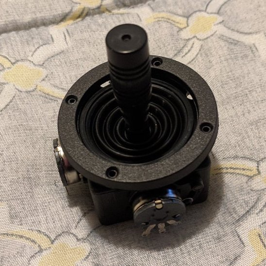
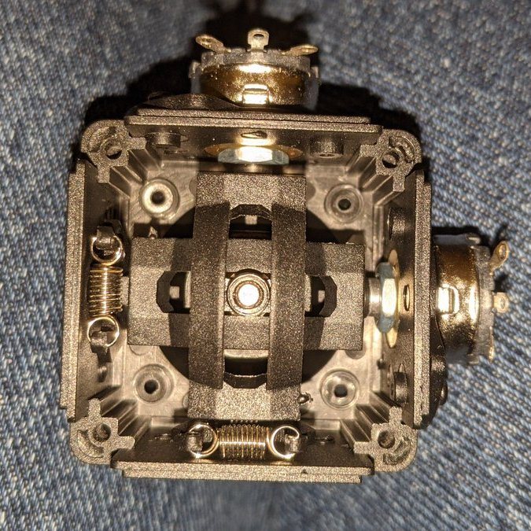
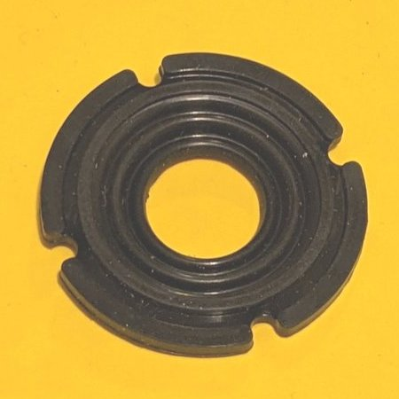
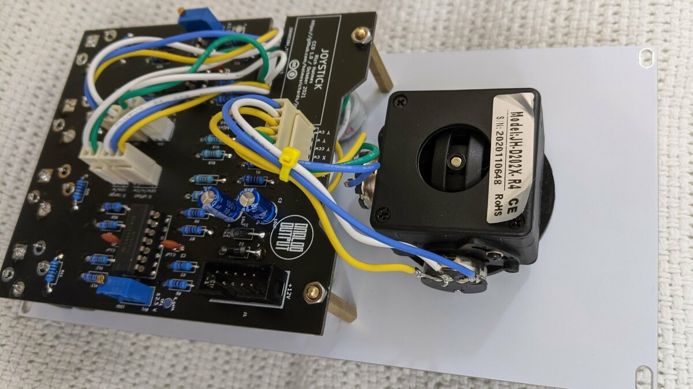
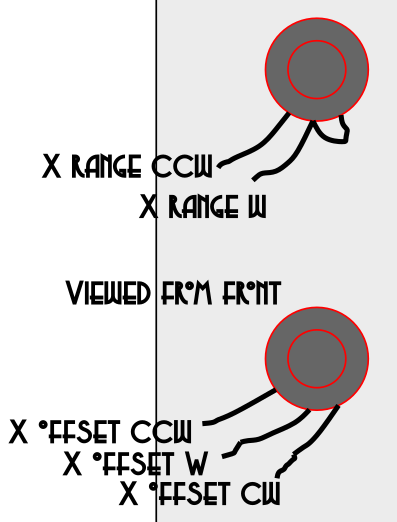

# Joystick build notes

This is mostly a straightforward build, but read below for some important information.

# Joystick

The joystick is a model JH-D202X-R4, available on sites such as AliExpress, Amazon Marketplace, and eBay. There are various versions of this joystick; I designed for the one with 10k potentiometers. (Using different pots just requires adjusting resistance values, though.)

As supplied, the joystick has springs that pull the stick back to center when released. If you don't want that behavior, you can remove the cover of the joystick to reveal the springs:

You can remove the springs without breaking anything. Save them somewhere you can find them in case you change your mind!

Without the springs the joystick still will return toward the center if released at extreme positions due to the rubber boot. You can just cut the boot off and leave it out but I found I could use a small pair of sharp scissors to widen the central hole in the boot, and then the joystick will stay put when released. Enough of the boot will be left to look good and prevent at least some amount of dust from getting in.

## Pot and resistor values and calibration

Pot tolerances being what they are, or rather aren't (20% for Alphas!), there are trimmers provided to tune the joystick range. Measure voltage at each test point and adjust the corresponding trimmer to get about ±2.5 V at the extremes of the joystick motion. I found the limits were asymmetric, I'm guessing due to different power rail voltages due to different loads on the Schottky diodes, so I aimed for 2.5 V on whichever had the smaller size. The output range will be about 4x this voltage, so 10 V end to end.

There are no trimmers to adjust the offset ranges, because I care less about that and because each is affected by only one pot versus the two that affect the joystick range. They should be approximately ±1.67 V at the pot wiper (depending on the actual pot value, PSU voltage, and Schottky diode drop), and a little large is better than a little small. You can select pots that measure as close as possible to 100k, or compensate for a too large or too small pot value by adjusting the 300k resistor values. I suggest

|With actual pot resistance|Use fixed resistors|
|----|---|
| 80k–90k | 240k |
| 90k–100k | 270k |
| 100k–110k | 300k |
| 110k–120k | 330k |

though none of this is critical. The offset range on the outputs should come out to about -5 V to 5 V.

## Wiring connections

The footprint for the 6-position Molex connector is labeled with things like "X ccw" and "Y cw", but don't take that too literally. The joystick can be mounted in any of four orientations and the wiring will differ for each. So move the joystick left and measure the resistances of the horizontal pot end terminals to the wiper to see which end the wiper shorts to; that will be your "X ccw" terminal regardless of whether you think it's really counterclockwise or not. Likewise, move the joystick down and identify the vertical pot terminal that shorts to the wiper, and that's your "Y ccw" terminal. The other ends connect to the "cw" positions and the wipers to the "w" positions.

Here's what I did:

The other pots are more straightforward, with the counterclockwise (as viewed from front) terminal connecting to "ccw", et cetera. On the range pots it actually doesn't matter which way around they are connected to the PCB, but you do want to make sure to connect the wiper to the cw end, leaving that and the ccw end to be wired to the connector.

## Errata

On the first run of PCBs, R2 is shown on the silkscreen as 15k. It should be 20k. This has been fixed in the KiCad files and Gerbers.