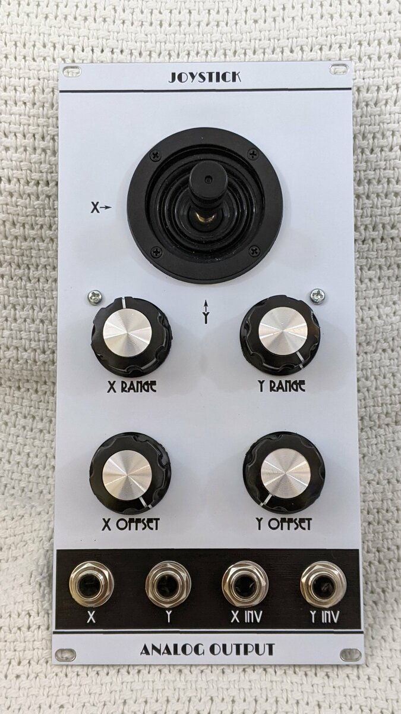
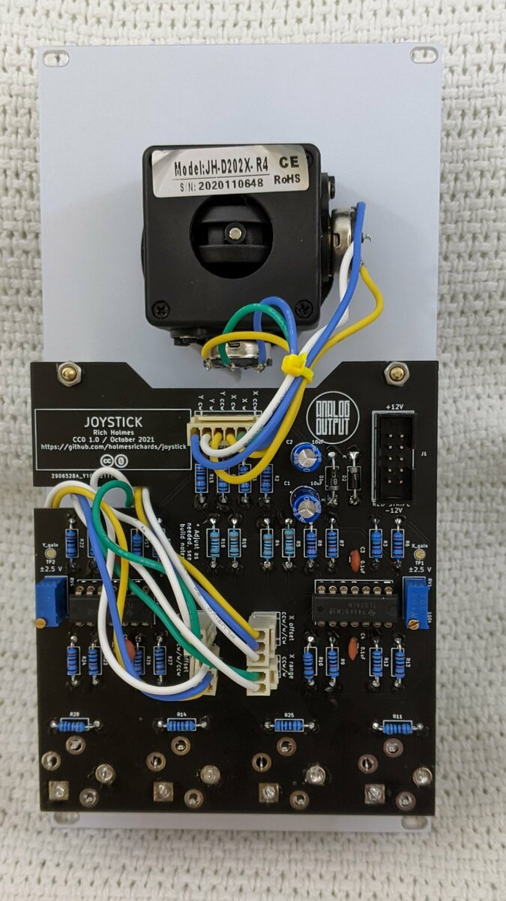

# Analog Output Joystick

This is a Kosmo format synth module that provides an interface for an analog joystick. The X and Y outputs provide control voltages that vary with the horizontal and vertical positions, respectively, of the joystick.

There are range control pots for X and Y. These adjust the width of the control voltage range. With the width fully clockwise the control voltage range is about 10 V end to end.

There also are offset control pots. These add a DC offset of between -5 V and 5 V to the output. So with the range pot at maximum and the offset pot centered the output voltage ranges from about -5 V to 5 V; with the offset pot fully clockwise the output voltage range is about 0 V to 10 V.

The X output voltage increases as you move the joystick from left to right, and Y increases from down to up. There also are two inverted output jacks; here the X output increases from right to left and the Y increases from up to down. Both outputs have the same range and same offset (with same sign), so for instance if the regular output is from 0 V to 10 V left to right, the inverted output will be 10 V to 0 V left to right.


## Photos






## Documentation

* [Schematic](Docs/joystick.pdf)
* PCB layout: [front](Docs/joystick_layout_front.pdf), [back](Docs/joystick_layout_back.pdf)
* [BOM](Docs/joystick_bom.md)
* [Build notes](Docs/build.md)
* [How it works](Docs/howitworks.md)

## GitHub repository

* [https://github.com/holmesrichards/WaveShaper](https://github.com/holmesrichards/joystick)


## Submodules

This repo uses submodules aoKicad and Kosmo_panel, which provide needed libaries for KiCad. To clone:

```
git clone git@github.com:holmesrichards/<projectname>.git
git submodule init
git submodule update
```


Alternatively do

```
git clone --recurse-submodules git@github.com:holmesrichards/<projectname>.git
```

Or if you download the repository as a zip file, you must also click on the "aoKicad" and "Kosmo\_panel" links on the GitHub page (they'll have "@ something" after them) and download them as separate zip files which you can unzip into this repo's aoKicad and Kosmo\_panel directories.

If desired, copy the files from aoKicad and Kosmo\_panel to wherever you prefer (your KiCad user library directory, for instance, if you have one). Then in KiCad, add symbol libraries 

```
aoKicad/ao_symbols
Kosmo_panel/Kosmo
```
and footprint libraries 
```
aoKicad/ao_tht
Kosmo_panel/Kosmo_panel.
```
